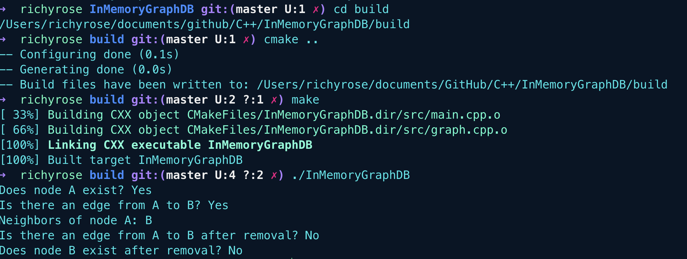

# In-Memory Graph Databases

## Introduction to Graph Databases

Graph databases are designed to handle and query relationships between entities. Unlike traditional relational databases that use tables and rows, graph databases use nodes (entities) and edges (relationships) to model data. This structure is particularly useful for applications involving complex relationships, such as:

Social Networks: Modeling users and their connections.

Recommendation Engines: Analysing user preferences and connections.

Fraud Detection: Identifying suspicious patterns and relationships.

Network Analysis: Understanding complex networks and dependencies.

The graph model allows for efficient querying and manipulation of relationships, making it an ideal choice for applications requiring deep insights into interconnected data.

## Node and Edges

In a graph database, nodes are the fundamental units that represent entities or objects. 

Each node can hold data in the form of key-value pairs, similar to how a row in a relational database might have multiple columns. 

Nodes are connected to each other through edges, which represent relationships.

## Key Characteristics of Nodes:

  1. **Identity**: Each node has a unique identifier that distinguishes it from other nodes in the graph.
  2. **Properties**: Nodes can have properties, which are key-value pairs. These properties store information about the node, such as attributes or characteristics.
                     For example, a node representing a person might have properties like name, age, and email.
  3. **Labels**: Nodes can have one or more labels, which are used to group nodes into sets.
                 Labels provide a way to categorize nodes, making it easier to query and manage them.
                 For instance, nodes representing people might be labeled as Person, while nodes representing books might be labeled as Book.

## Examples of Nodes:

Here are some examples of nodes in different contexts:

1. **Social Network**: Person node with properties like name, age, location, and email.
2. **E-commerce**: <ul>Product node with properties like product_id, name, price, and category.</ul>
               <ul>Customer node with properties like customer_id, name, email, and purchase_history.</ul>
3. **Knowledge Graph**: Entity node with properties like entity_id, name, type, and description.


Product node with properties like product_id, name, price, and category. <br>
Customer node with properties like customer_id, name, email, and purchase_history.
Knowledge Graph:

Entity node with properties like entity_id, name, type, and description.


## Project Overview

This project involves creating a simple in-memory graph database in C++. 

The aim is to implement core functionalities such as adding and removing nodes and edges, and querying the graph. 

The project demonstrates:

**Graph Management**: How to manage nodes and edges in a graph.

**C++ Implementation**: Using modern C++ features to handle data efficiently.

**Performance Considerations**: Implementing and optimising data structures for effective graph operations.

## Key Features

  - Add or Remove Nodes: Functions to manage nodes in the graph.
  - Add or Remove Edges: Functions to manage relationships between nodes.
  - Query Neighbours: Retrieve neighbours of a specific node.
  - Check Existence: Verify if nodes and edges exist.

## Project Structure

The project is organized into the following directories and files:

```makefile
InMemoryGraphDB/
├── include/
│ └── graph.h # Header file defining the Graph class
├── src/
│ ├── graph.cpp # Source file implementing the Graph class
│ └── main.cpp # Main program to test Graph functionality
├── tests/ # (Optional) Directory for unit tests
├── CMakeLists.txt # CMake configuration file for building the project
```

## Building and Running the Project

To build and run the project, follow these steps.

Firstly, Clone the Repository:

```sh
git clone https://github.com/richardwaters9049/InMemoryGraphDB.git
cd InMemoryGraphDB
```

Create a Build Directory and Navigate Into It:

```sh
mkdir build
cd build
```

Run CMake to Configure the Project:

```sh
cmake ..
```

Build the Project:

```sh
make
```

Run the Executable:

```sh
./InMemoryGraphDB
```

## Usage

After running the executable, the program will demonstrate the following functionalities:

- Adding nodes and edges.
- Removing nodes and edges.
- Querying the existence of nodes and edges.
- Retrieving and displaying neighbors of a node.

## Graph Database Output


